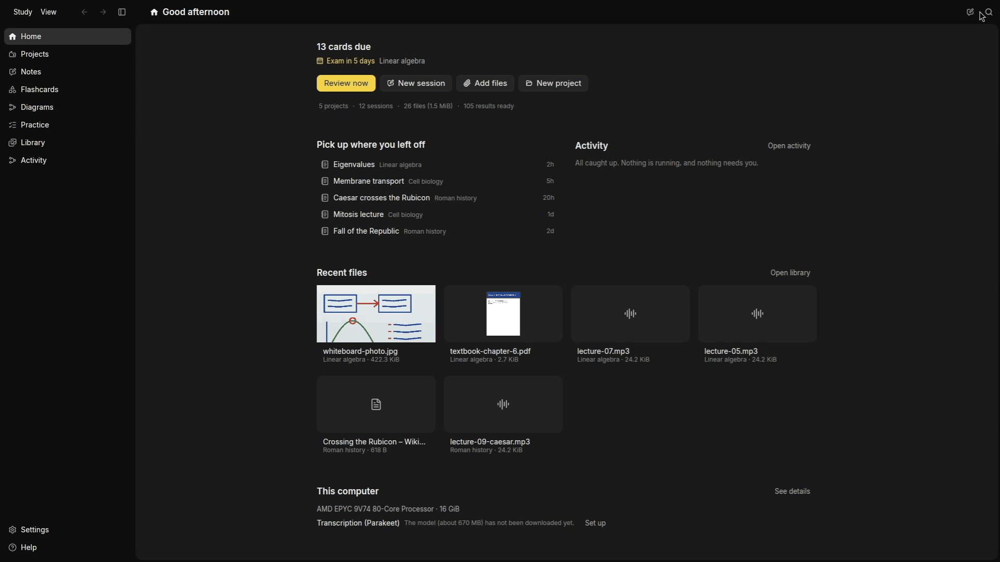

# Study

A calm place for everything you learn.

Study is a local-first desktop study app. You bring what you study from (recordings, slides,
PDFs, pictures, documents, web pages and YouTube videos); Study reads it, answers your
questions about it with citations to the page or the moment in the recording, and turns it
into study material, flashcards on a spaced-repetition schedule, and practice. It is for
serious learners: university students taking several courses, self-learners, and people
studying for a certification.

**Status:** pre-release. Release builds target Linux x64/ARM64, macOS Intel/Apple Silicon,
and Windows x64. Linux AppImages need glibc 2.41 or newer (Debian 13+, Ubuntu 25.04+).



*Sample data, recorded with `just demo`.*

## Get Study

Download the package for your computer from
[GitHub Releases](https://github.com/nicksan222/study/releases):

- Linux: `study-linux-x86_64.AppImage` or `study-linux-aarch64.AppImage`.
  Make it executable (`chmod +x study-linux-*.AppImage`) and launch it.
- macOS: `study-macos-x86_64.dmg` or `study-macos-aarch64.dmg`; copy Study to Applications.
- Windows: run `study-windows-x86_64.exe`, the installer for your user account.

In Settings, check for updates and choose when to install them. Updates are downloaded from
GitHub and verified with the release signing key before installation. Your database,
preferences and downloaded models remain in the application's data directory.

Two programs are optional: [yt-dlp](https://github.com/yt-dlp/yt-dlp), to bring in YouTube
videos, and FFmpeg, for rare recording formats such as AMR and WMA.

## What AI needs

- **A ChatGPT Plus or Pro plan.** You sign in with ChatGPT in the app, and the language
  models run on your plan, within its usage limits, shared with ChatGPT itself. Study has no
  API key of its own and adds no AI bill.
- **What goes to OpenAI:** only what model work needs: the pages of PDFs and pictures to
  read, and the notes, transcripts and passages that answers, titles, study material, quiz
  questions and grades are made from.
- **What stays on your computer:** your database and your recordings. Speech-to-text and
  search run here, on two local models: speech-to-text (about 670 MB) and search (about
  135 MB). They download only when you choose to, in the welcome tour or later in Settings,
  under AI.
- Study also connects to Hugging Face to download those models, and to the web pages and
  videos you add.

## Where your data lives

- `~/.local/share/study/`: the database (`study.sqlite3`) and `diagnostics.log`.
- `~/.cache/study/models/`: the local models.

Both follow `XDG_DATA_HOME` and `XDG_CACHE_HOME`.

## Develop

Start at [AGENTS.md](AGENTS.md): the rules, the crate map and the commands. Everything else
is in the code, beginning with each crate's `src/lib.rs`.
[CONTRIBUTING.md](CONTRIBUTING.md) says how to send a change.

### In the devcontainer

The devcontainer (`.devcontainer/`) installs every tool. Open the folder in VS Code and
reopen it in the container, or use the devcontainer CLI:

```sh
devcontainer up --workspace-folder .
devcontainer exec --workspace-folder . bash
```

The app and agents run inside the container. To test the app yourself:

```sh
just run
```

This starts the virtual desktop and its browser connection before launching Study. In a
VS Code devcontainer terminal it asks VS Code to open your host browser. In a plain
container terminal, open the printed link yourself. Keep the terminal open; Ctrl+C stops
the app. `just desktop-attach` is the background/reconnect command when you want the app
to outlive the terminal.

Open the printed [desktop address](http://127.0.0.1:5900/vnc.html?autoconnect=1&resize=scale)
in your host browser to use the same virtual desktop the agents see. Reconnect with
`just desktop-attach`. No VNC client or host display forwarding is needed.
The published port is bound to your machine's loopback interface only.

Study opens sign-in pages in Chromium **inside** that desktop, so its local OAuth callback
stays in the container. `just desktop-browser` also opens Chromium manually. Its profile is
kept in `target/desktop/browser-profile`, and Study's development data in `target/dev-data`;
both survive container rebuilds through the workspace mount. Sign in yourself once;
deleting those directories removes the saved state. `just desktop-stop` stops the session
without deleting it.

This is the Linux app viewed from your browser, including on macOS; it does not validate a
native macOS build. Host microphones and audio are not forwarded by this desktop connection.

`just check` is what CI runs, and `just --list` shows every other command. `just demo`
records the GIF at the top of this file from sample data, on its own private desktop.
The container installs the agent tools and mounts your AI logins. `just agents-doctor`
checks subscription access; `just agents` starts one project-wide team: lead, developer, PM, QA, student, reviewer and pushback.
`just agents-stop` stops that team. Roles wait for concrete assignments; the lead avoids
sending the same work to multiple roles. For a smaller task, start selected roles with
`just agents lead developer --no-attach`; an eighth slot is shared by on-demand scenario preparation, upgrade review and PR delivery.
`just agents-usage --hours 24` reports local Claude token counts, including cache usage,
not remaining subscription allowance. Provider/model choices live in `.agents/team/fleet.toml`: the lead uses Opus 5.5
at high effort, the reviewer uses Opus 5.5 at medium, the upgrade reviewer uses Sonnet 5.5 at medium, and other roles use Sonnet 5.5 at medium. Existing conversations
keep their settings until restarted.

For daily use, these are the commands to remember:

| Command | What it does |
|---|---|
| `just run` | Run Study and prepare its browser desktop; Ctrl+C stops the app. |
| `just agents` (or `just agent`) | Open the seven-role team, preserving existing conversations. |
| `just agents-reset` | Start fresh conversations and clear the team's current task checkpoint. |
| `just agents-stop` | Stop the team and close its panes. |
| `just desktop-stop` | Stop Study, Chromium and the virtual desktop; keep saved app/browser data. |

Herdr's **Study team** workspace actions also offer **Reset all agent context** and
**Stop all Study agents**. Reset interrupts current agent work, so use it at a task
boundary. It keeps source edits, credentials and provider conversation history; it does
not delete files to reduce disk usage. `just trim` is the separate build-cache cleanup.
Neither reset nor stop affects other Herdr workspaces.

The setup follows this sequence:

1. Open the default devcontainer. Its `initialize.sh` prepares host login mounts; the
   Dockerfile installs tools; `post-create.py` configures hooks, plugins and GitHub access.
   On each container start, Graphify refreshes a local code index ignored by Git.
   Agents use `.agents/skills/graphify/` to query it.
   Linux releases use the same devcontainer; CI and the macOS and Windows releases use native runners.
2. Run `just agents-doctor` to verify tools and subscription login without a model request.
   Preview selected roles with `just agents --dry-run`. Start them with `just agents`.
3. Give the lead the task. It assigns scoped work across the project, shares evidence,
   and keeps a short checkpoint in `target/agents/study/task.md` for later recovery.
4. Run `just run` to test the app, or `just desktop-attach` to reconnect to an agent run.
   Coordinate desktop use with QA/student agents; there is one shared session. Logs live in `target/desktop`.
5. Run `just check` before delivering a change. `just check-shell` is the focused tooling
   check: ShellCheck over the devcontainer and packaging scripts.
6. Use `just agents-stop` when done. Repeating `just agents` preserves running conversations;
   `just agents-reset` starts over without the previous task checkpoint. `--fresh` is
   for restarting conversations while retaining that checkpoint. `--session NAME` isolates
   unrelated work, not a second team doing the same task. Model-setting changes apply to new conversations.

### Preparing a test or demo scenario

Ask the lead for the state you need, for example: “Prepare synthetic study cards with an
empty review queue” or “Exercise a provider timeout.” It starts `scenario` to reuse or
extend the existing seeds and mocks, then passes a reproducible handoff to QA or student.
For manual startup: `just agents scenario --no-attach`. Scenario and PR maker share one
optional slot; finish and stop one before starting the other when the regular team is up.

Scenario data lives in a separate directory under `target/agents/<session>/scenarios/`;
your regular development data stays intact. Handoffs identify code, inputs, reproduction
steps and what was simulated. Consumers recheck those facts before reuse. A seeded screen
is labelled as seeded in a PR demo, not presented as proof that a real model produced it.
The role checklist explains isolated app launch and restoring the usual desktop.

### Checking that a change upgrades safely

Ask the lead “Will this break anything on upgrade?”, or let it decide when a change
touches the schema, stored codes, serialized data, files on disk, dependencies or the
toolchain. It starts `upgrade-reviewer`, a Sonnet reviewer that checks only whether an
existing database, data directory, checkout or container still works after the change.
Internal API changes are not findings: only released data is kept. For manual startup:
`just agents upgrade-reviewer --no-attach`. It shares the optional slot with scenario
and PR maker. The checklist lives in `.agents/team/roles/upgrade-reviewer.md`.

### From a request to a PR

Give the lead a task such as: “Fix the review navigation and take it through a PR.” It
coordinates implementation and checks, then starts `pr-maker` once to handle delivery.
The PR maker reuses QA evidence, commits only the task changes, pushes the feature branch,
and creates or updates the pull request. It does not merge. Local-only and unstaged-work
requests still take precedence. No file watcher or extra always-running reviewer is added.

Visible interactions get a short real-app demo; static changes can use a screenshot.
Internal-only changes get a clear explanation and test evidence instead of a ceremonial
video. Record with `just desktop-record`, then prepare the attachment:

```sh
just showcase target/desktop/clip.mp4 target/desktop/showcase.mp4
```

Use `.gif` for a looping GIF. Conversion keeps the first 15 seconds, removes audio and
limits output to 8 MB; MP4 is normally smaller. Files stay in gitignored `target/`.
The PR maker inspects the result, then attaches it directly to the PR with GitHub CLI's
[`--attach`](https://docs.github.com/en/github-cli/github-cli/attaching-files-with-github-cli)
option. Reviewers see hosted media in the PR; no extra release, media branch or service.

The agents image pins a recent GitHub CLI with attachment support. Host GitHub credentials
are forwarded at startup, including tokens stored in the host
keyring; Git uses the container's `gh` credential helper for HTTPS. Host `user.name` and
`user.email` are exported with include rules resolved and included in the container's Git
configuration. Token and identity files are private runtime mounts, never image layers.
After changing host login or identity, reopen the container to refresh those exports.
Host-specific signing programs and SSH private keys are not copied; use an HTTPS GitHub
remote for this workflow. The base contributor container receives none of these mounts.
Publishing needs a configured GitHub remote and a login with push access.
If either is missing, the team preserves the prepared work and reports what is needed.
To start just the delivery role manually: `just agents pr-maker --no-attach`.
The detailed delivery checklist lives in `.agents/team/roles/pr-maker.md`.

The tooling uses standard-library Python for configuration, JSON, process management and
cache cleanup. Shell scripts only handle the small desktop launch steps. Start reading at
`Justfile`, then follow its command into the corresponding Python `main()` or shell script.
`fleet.toml` is data: the regular team, on-demand specialists and provider/model choices,
with no shell syntax.

The launcher comments explain validation, authentication, locking and pane ownership;
`.devcontainer/desktop/` explains desktop startup, browser profiles and process cleanup.

### On your own Linux machine

You need glibc 2.38 or newer. On Debian or Ubuntu:

```sh
sudo apt install build-essential pkg-config clang libfontconfig-dev libwayland-dev \
  libxkbcommon-x11-dev libx11-xcb-dev libssl-dev libzstd-dev libvulkan1 \
  libasound2-dev mesa-vulkan-drivers ffmpeg
```

Then install Rust with [rustup](https://rustup.rs) (`rust-toolchain.toml` picks the
version) and [just](https://github.com/casey/just), and:

```sh
just reset-data   # a development database with sample projects
just run
```

`just run` keeps its database in `target/dev-data`, apart from your own. In the container (or without
a display), it starts the browser desktop automatically; `just desktop-attach` reconnects to it. The first build
takes a while, and `target/` can grow to 40 GB. `just check` also needs Docker, for the
tests that run real services.

Close Study before `just reset-data`; a shared data lock prevents managed app runs
and reseeding from overlapping.

## License

Study is licensed under either of [Apache License 2.0](LICENSE-APACHE) or
[MIT license](LICENSE-MIT), at your option. [NOTICE](NOTICE) lists the bundled third-party
files and their licenses.

## Releases and updates

To release, bump `version` in the workspace `Cargo.toml`, commit, then push a matching tag:
`git tag v0.2.0 && git push origin v0.2.0`. The workflow refuses a tag that does not match the
workspace version, builds all five signed packages, and publishes the release only when every
one exists, with package signatures, `SHA256SUMS` and the `latest.json` update feed. A failed
build can be rerun from Actions.

One-time repository setup, using the pinned `cargo packager` in the devcontainer:

1. Run `cargo packager signer generate --path /secure/location/study.key` and retain a
   secure backup of the key and its password. Never commit this file.
2. Set the **repository variable** `STUDY_UPDATE_PUBLIC_KEY` to the contents of the generated
   `.pub` file, and the **repository secret** `CARGO_PACKAGER_SIGN_PRIVATE_KEY` to the private
   key file contents. Set `CARGO_PACKAGER_SIGN_PRIVATE_KEY_PASSWORD` to its password
   (omit only for an unencrypted key).
3. Allow Actions to write repository contents. The workflow requests this permission only
   to publish the release.

Update signatures are separate from platform code signing. For notarized macOS packages,
set the secrets `APPLE_SIGNING_IDENTITY`, `APPLE_CERTIFICATE` (base64 P12),
`APPLE_CERTIFICATE_PASSWORD`, `APPLE_ID`, `APPLE_PASSWORD` (app-specific password), and
`APPLE_TEAM_ID`. Without them macOS packages are unsigned and Gatekeeper requires a manual
exception. Windows installers are currently unsigned and can trigger SmartScreen.

For a local signed package, export the public-key and signing variables above, set
`STUDY_UPDATE_ENDPOINT=https://github.com/OWNER/REPO/releases/latest/download/latest.json`, and run
`just package linux-x86_64` (or the matching native platform). Native release runners run
`packaging/release.sh package PLATFORM` with cargo-packager 0.11.8.
The app reads updates from GitHub Releases; there is no additional update service.
Rust updater tests exercise update manifests and signed downloads against a local server.
